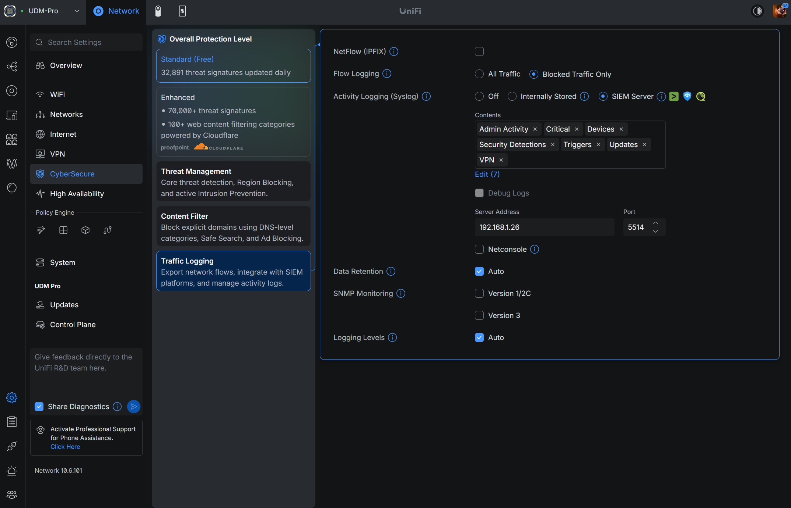

# UniFi SIEM Sink

MCP server that receives UniFi's CEF-over-syslog SIEM export, stores it in
SQLite with a retention window, and exposes it to an LLM over Streamable
HTTP — filling the one gap UniFi's own Network API leaves open: IPS/IDS
threat events.

## Why this exists

The UniFi Network Local API does not expose IPS/IDS threat events. The
`stat/ips/event` endpoint was removed in firmware 10.x with no documented
replacement, and there's an [open, unresolved community feature
request](https://community.ui.com/questions/Add-IPS-Threat-Management-Events-to-UniFi-Network-API/638a2897-7e66-449c-94f6-369be01ba2e9)
asking Ubiquiti to bring it back. The only remaining path to that data is
the UniFi Network app's own [SIEM/syslog
export](https://help.ui.com/hc/en-us/articles/33349041044119-UniFi-System-Logs-SIEM-Integration)
(Network > Integrations > System Logging), which does still carry
Security-category events (Firewall, Honeypot, Intrusion Prevention) in
Common Event Format (CEF). This service listens for that export, parses it
defensively (raw message always preserved, even when a field can't be
extracted), and stores it somewhere an LLM can actually query.

### Works alongside `unifi-mcp-server`

This project pairs with
[`unifi-mcp-server`](https://github.com/ianchesal/unifi-mcp-server), which
exposes the rest of the UniFi Network API (firewall rules, networks,
clients, traffic rules, port forwarding, monitoring, and the classic
`get_network_events` alarm feed) as MCP tools. Add both to your MCP client
and an LLM gets the full picture: `unifi-mcp-server` for everything the API
covers, `unifi-siem-sink` for the IPS/IDS and Security-category data the API
doesn't.

## Quick Start (Official Docker Image)

No repo clone needed — pull the published image directly from the GitHub
Container Registry.

### 1. Create a `.env` file

```bash
MCP_SECRET=<choose-a-strong-secret>
```

### 2. Run the container

```bash
docker run -d \
  --name unifi-siem-sink \
  --env-file .env \
  -p 3000:3000 \
  -p 514:10514/udp \
  -v unifi-siem-sink-data:/data \
  ghcr.io/ianchesal/unifi-siem-sink:latest
```

### 3. Point the UDM Pro at it

In the UniFi Network app, go to **Settings > CyberSecure > Traffic
Logging > Activity Logging (Syslog)**, select **SIEM Server**, and add
`security_detections` to Contents (along with any other categories you
want — `admin_activity`, `critical`, `device`, `triggers`, `updates`,
`vpn` are also available). Enter this host's IP as **Server Address** and
`514` as **Port**.



Older UniFi OS versions expose this same setting under **Integrations >
System Logging** instead — if you don't see **CyberSecure** in the left
nav, look there. See [Troubleshooting](#troubleshooting) below if events
still aren't showing up after this.

### 4. Add to your MCP client

```json
{
  "mcpServers": {
    "unifi-siem": {
      "type": "http",
      "url": "http://<homelab-ip>:3000/mcp",
      "headers": { "Authorization": "Bearer <your-MCP_SECRET>" }
    }
  }
}
```

## Tools

| Tool | Description |
|---|---|
| `list_events` | List stored UniFi SIEM events. Filters: since/until (ISO8601 timestamps, filtered on receipt time), category, severity_min, source_ip/dest_ip (exact match or CIDR, e.g. "10.0.30.0/24"), limit (default 100, max 500), offset. |
| `get_event` | Get a single stored event by id, including its full raw syslog message. |
| `get_categories` | List the distinct event categories currently present in the store (e.g. "ips_alert", "firewall_block", "honeypot", "admin_action", "unknown"). |
| `get_event_stats` | Get aggregate event counts grouped by category, severity, or source_ip, optionally within a time range (since/until, ISO8601). |

## Environment Variables

| Variable | Required | Default | Description |
|---|---|---|---|
| `MCP_SECRET` | yes | — | Bearer token for MCP endpoint auth |
| `SYSLOG_UDP_PORT` | no | `10514` | In-container UDP listen port for incoming syslog/CEF traffic (the Docker image maps host `514/udp` to this) |
| `SYSLOG_BIND_ADDRESS` | no | `0.0.0.0` | Interface the syslog listener binds to |
| `MCP_PORT` | no | `3000` | Port the MCP/HTTP server listens on |
| `MCP_HOST` | no | `0.0.0.0` | Interface the MCP/HTTP server binds to |
| `DB_PATH` | no | `/data/events.db` (Docker) | SQLite database file path. Set by the Docker image for container deployments — only override for local (non-Docker) runs |
| `RETENTION_DAYS` | no | `90` | Events older than this are purged on a rolling basis |
| `MAX_MESSAGE_BYTES` | no | `16384` | Datagrams larger than this are dropped before parsing |
| `LOG_LEVEL` | no | `info` | `error` \| `warn` \| `info` \| `debug` |

---

## Development (Running from a Repo Clone)

### Setup

```bash
git clone https://github.com/ianchesal/unifi-siem-sink
cd unifi-siem-sink
npm install
cp .env.example .env
# Edit .env and set MCP_SECRET to a strong, unique value
```

### Run with Docker Compose

```bash
docker compose up -d --build
```

This builds the image (see `Dockerfile`) and starts the container, exposing:

- `3001/tcp` (mapped to the container's `3000/tcp`) for the MCP/HTTP server (health checks, MCP endpoint)
- `5514/udp` (mapped to the container's `10514/udp`) for incoming syslog/CEF traffic

Event data persists in the `siem-data` named volume, backed by SQLite at
`/data/events.db` inside the container.

### Run locally

```bash
npm run build && npm start
```

This compiles TypeScript to `dist/` and runs the compiled server with
`node --env-file=.env dist/index.js` — the same path used in the Docker
image.

**Known issue — `npm run dev` is currently broken on Node 24.x and 25.x.**
The `dev` script (`node --experimental-strip-types src/index.ts`, with
`NODE_OPTIONS=--experimental-sqlite` for Node < 23.4) is intended to run the
TypeScript source directly in watch mode without a build step. However, on
this project's tested Node versions (v24.10.0 and v25.8.2), it fails with
`ERR_MODULE_NOT_FOUND`: Node's `--experimental-strip-types` flag does not
resolve `.js`-suffixed relative imports against sibling `.ts` files the way
`tsc` does. This is a pre-existing limitation also present in the sibling
`unifi-mcp-server` project's identical `dev` script — it is not unique to
this codebase. Until that's resolved (e.g. by adopting a tool like `tsx`, or
if the sibling project's convention changes), use `npm run build && npm
start` for local runs, rebuilding after each change.

### Tests

```bash
npm test          # run the full suite
npm run test:watch
npm run lint       # biome check
```

### Integration tests (requires real UDM Pro)

This test tier does not exist yet. The current test suite runs entirely
against synthetic and recorded CEF fixtures — see
`tests/fixtures/real-cef-samples.md` for real samples captured from a live
UDM Pro (Network app 10.6.101), used to ground the parser in genuine device
output. Real integration tests should be added once a broader, more
representative sample set is available.

---

## Troubleshooting

### No events showing up at all

Start with the sink itself, before suspecting the UDM:

```bash
curl http://<homelab-ip>:3000/health
# {"status":"ok","droppedMessages":0}
```

`droppedMessages` only counts oversized datagrams (see `MAX_MESSAGE_BYTES`)
— it won't be nonzero just because nothing has arrived. If the container's
been running and `get_categories` / `list_events` show nothing but `Test
Syslog` / `Admin Made Config Changes` entries from initial setup, the UDM
likely isn't sending traffic to this host at all, which almost always means
its SIEM destination config is wrong or stale.

**UniFi's UI has more than one place this setting can live** (a
UniFi‑OS‑level "System Log" panel and the Network app's own
CyberSecure/Integrations panel, depending on firmware version), and it's
easy to configure the wrong one, or one that's since been superseded, and
not notice — the UI gives no indication that a previously‑set destination
elsewhere is now dead weight. If re-checking the UI settings (see [Point
the UDM Pro at it](#3-point-the-udm-pro-at-it) above) doesn't turn up the
problem, confirm what the controller actually has configured by SSHing
into the UDM and querying its config database directly:

```bash
ssh root@<udm-ip>
mongo --port 27117 ace --eval 'db.setting.find({key: "rsyslogd"}).pretty()'
```

This returns the live `rsyslogd` settings document — `ip`, `port`,
`enabled`, and `contents` (the selected log categories). Confirm `ip`/`port`
match this host, `enabled` is `true`, and `contents` includes
`security_detections`. This is read-only and safe; don't write to this
database — make any corrections through the UI.

### Container shows `unhealthy` but the service is fine

If `docker compose ps` shows `(unhealthy)` while `curl .../health` from the
host works fine, check whether the healthcheck itself is broken rather than
the service — `wget http://localhost:3000/health` run *inside* the
container can fail with `Connection refused` if `localhost` resolves to
`::1` and the app isn't listening on the IPv6 loopback, even though
`127.0.0.1` works. `docker-compose.yml`'s healthcheck uses `127.0.0.1`
explicitly for this reason; if you've customized it, avoid `localhost`
there.

### Verifying end-to-end delivery

UniFi's IDS/IPS engine (Suricata-based) has a well-known benign test
signature you can trip safely from any LAN client, without needing to wait
for a real intrusion attempt:

```bash
curl http://testmyids.com
```

This returns a canned `uid=0(root) gid=0(root) groups=0(root)` response
that exists specifically to trigger the `GPL ATTACK_RESPONSE id check
returned root` signature. A "Threat Detected and Blocked" event should show
up in `list_events` (category `ips_alert`) within a few seconds if the
pipeline — UDM export config, network path, and this sink — is wired up
correctly end to end.

## Cutting a release

Releases are tag-driven. Pushing a `v*` tag to GitHub triggers
`.github/workflows/release.yml`, which:
- Builds and pushes a Docker image to `ghcr.io/ianchesal/unifi-siem-sink`
  (tagged `latest`, `{major}.{minor}`, and `{version}`)
- Creates a GitHub Release with auto-generated notes

**Steps to release:**

1. Ensure all changes are merged to `main` and CI is green.
2. Decide the new version (follows semver: `MAJOR.MINOR.PATCH`).
3. Update `"version"` in `package.json` to the new version.
4. Commit: `git commit -m "chore: release v{version}" package.json`
5. Tag: `git tag v{version}`
6. Push both: `git push origin main && git push origin v{version}`

The release workflow fires automatically on the tag push. No manual Docker
build or GitHub Release creation needed.

## License

[MIT](LICENSE)
